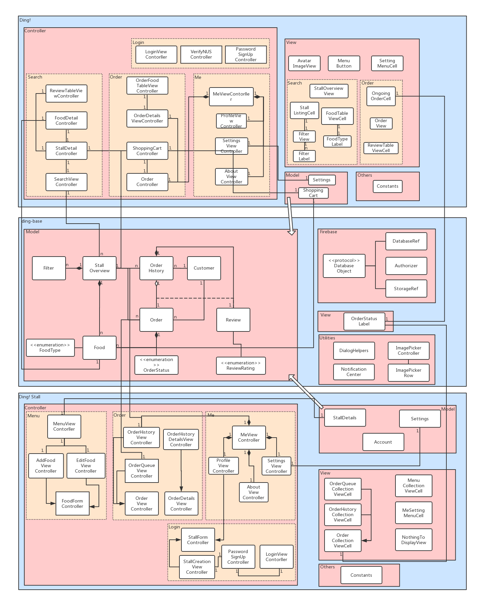

# Ding!

<p align="center">

<a href="https://developer.apple.com/swift"></a>
</p>

`Ding!` and `Ding! Stall` is your best choice to browse, order, collect and review food in NUS.

## Project Setup

1. Clone the repository into your computer locally (assuming SSH key has been setup).
```bash
git clone git@github.com:yunpengn/ding-food.git
```
2. Notice that there are two Xcode workspaces within this repository, located in the folder `ding` and `ding-stall` respectively. In addition, there is a folder `ding-base`, which is used to act as the base library (i.e., a CocoaPod) for this project.
3. Make sure you have installed [CocoaPods](https://cocoapods.org) on your computer.
4. Now close all Xcode windows which have been opened.
5. Install dependencies for the `ding` workspace.
```bash
cd ding
pod install
```
6. Install dependencies for the `ding-stall` workspace.
```bash
cd ding-stall
pod install
```
7. Now, you have all dependencies installed and are ready to go.
8. Open your Xcode and click `Open Another Project...`, select `ding.xcworkspace` to open the first workspace, or select `ding-stall.xcworkspace` to open the second workspace.

## Project Structure



## Repository Workflow

1. We are using feature branch workflow rather than fork workflow.
2. Whenever you are trying to fix a bug or add a new feature, created a new branch whose name describes the purpose clearly.
```bash
git branch <new_branch_name>
git checkout <new_branch_name>
```
3. Push this new branch to the remote repository.
```bash
git push origin <new_branch_name>
git branch --set-upstream-to=origin/<new_branch_name> <new_branch_name>
```
4. Since we encourage you to always use a new branch each time, the branch should be deleted (using GitHub interface) after the PR is merged or declined. Don't worry, GitHub uses _soft delete_, we can restore the branch later.
5. To avoid some merge conflicts and due to many other factors, we ignore the `Pods/` folder.
6. Whenever you open a PR, please assign it to yourself (or anyone else if appropriate). Then, ask someone else to do PR review by assigning him/her as the reviewer.

## Setup Global `gitignore`

To avoid committing OS-specific files into the remote repository, you should setup the global `gitignore` file on your computer:
```bash
echo .DS_Store >> ~/.gitignore_global
git config --global core.excludesfile ~/.gitignore_global
```

## Troubleshooting

#### Could not build Objective-C module 'XXX'

This is because the building order of certain libraries is troublesome. To solve this problem,
1. First ensure you have run `pod install` to install or update all dependencies to the latest version.
2. Build (rather than direct _run_) all frameworks once (by pressing `Command+B`).
3. Now, try to run the application. It should work.
